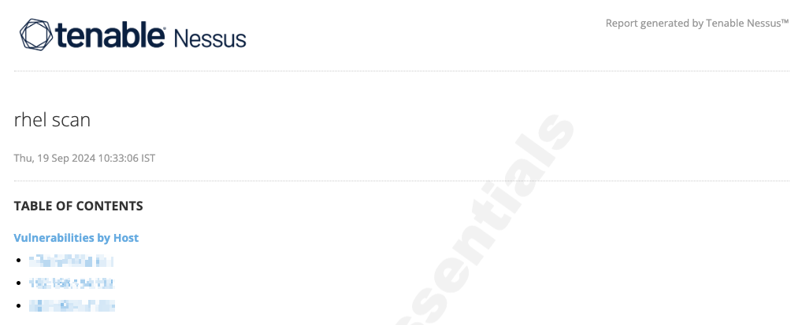

# ansible-lab

# Patching

## In this lab we will be patching a high vpr vulnerability openssh on couple of rhel servers

### Servers used


| Server | OS            |
| :------- | --------------- |
| dev    | rocky linux 9 |
| node1  | rocky linux 9 |
| node2  | rocky linux 9 |

## Process of patching a high vpr vulnerability with ansible playbook

* Create a **inventory** file which consists of the nodes on which we will be applying the patches.

  ```
  [rhel_servers]
  node1
  node2

  ```
* Create a **ansible.cfg** file which consists of the default config to connect to the nodes.

  ```
  [defaults]
  inventory = inventory
  remote_user = sa-ki
  interpreter_python = auto_silent

  [privilege_escalation]
  become = true
  become_method = sudo
  become_user = root
  become_ask_pass = false
  ```
* Conduct a vulnerability scan with nessus as it provides a free version.

  
* From the scan we could see that openssh has the highest VPR score of 9.5, so we will be patching that vulnerability for our project.

  
* Create a external vars file which will host the package name and the version we want to update the package to remediate the vulnerability.

  ```
  package_name: "openssh"
  current_version: "8.7p1-38.el9"
  desired_version: "8.7p1-38.el9_4.4"
  full_package_name: "{{ package_name }}-{{ desired_version }}"
  ```
* Now comes the time to write a playbook which updates the vulnerable package to non vulnerable version.
* The run the playbook as:

  ```bash
  ansible-playbook patch.yml
  ```

  we can run it in dry mode to check if there are any issues with the playbook by passing in --syntax-check and --check arguments

  

---
